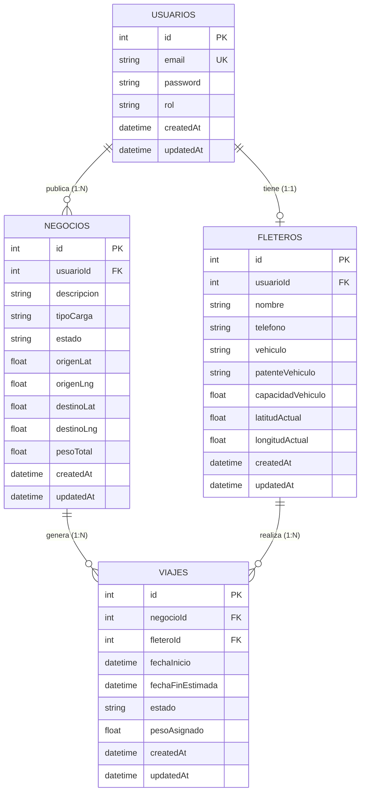

# Contexto y Convenciones del Proyecto — rut.ar

> **Documento Canónico de Referencia para Agentes de Inteligencia Artificial y Desarrolladores**  
> **Última actualización:** Septiembre 2026  
> **Estado del Repositorio:** Monorepo Nx en desarrollo activo (Backend con CRUDs y Auth completos; Frontend en etapa inicial; Matching y Tests en fase de implementación).

---

## 1. Resumen del Dominio de Negocio

### 1.1 Propósito y Problema Central
**rut.ar** es una plataforma web logística orientada a conectar a **Operadores Logísticos** con **Fleteros** independientes, bajo la supervisión de un **Administrador**.

El problema crítico que resuelve es la **ineficiencia del retorno vacío** (*empty haul / backhaul problem*). Cuando un fletero realiza un viaje de transporte de cargas desde una ciudad $A$ hasta una ciudad $B$, frecuentemente regresa a $A$ sin carga, desperdiciando combustible, tiempo y generando emisiones contaminantes innecesarias.  
**rut.ar** soluciona esto proveyendo un motor de sugerencia y *matching* geográfico inteligente:
1. Permite a los Operadores Logísticos publicar demandas de carga (**Negocios**) con coordenadas de origen y destino.
2. Sugiere Fleteros disponibles ordenados por cercanía geográfica al punto de carga utilizando la **fórmula de Haversine**, compatibilidad de capacidad en peso (kg) y estado de actividad.
3. Permite a los Fleteros con viajes activos encontrar **Negocios de Retorno** cuyo origen sea cercano al destino final de su viaje actual, minimizando el kilometraje en vacío.

### 1.2 Roles del Sistema (RBAC)
- **`ADMINISTRADOR`**: Acceso total al sistema. Monitoreo global de operaciones, consulta y administración de todos los usuarios, auditoría y métricas.
- **`LOGISTICO`**: Usuario empresa o dador de carga. Publica nuevos negocios/cargas, consulta fleteros cercanos mediante el motor de matching y asigna fleteros para concretar viajes.
- **`FLETERO`**: Conductor o transportista independiente. Dispone de un perfil con vehículo asociado, capacidad máxima de carga (kg) y geolocalización actual (`latitudActual`, `longitudActual`). Consulta cargas disponibles y viajes asignados.
- **`USUARIO`**: Rol base predeterminado al registrarse si no se especifica otro rol.

### 1.3 Entidades Principales y Modelo Relacional
El modelo relacional está implementado con **Sequelize-TypeScript** sobre **MySQL 8.0**:



#### Atributos y Reglas de Estado de las Entidades:
- **`Usuario`** (`usuarios`): Clave única en `email`. Password con hash `bcrypt` (10 rounds de salt). Roles admitidos: `ADMINISTRADOR`, `LOGISTICO`, `FLETERO`, `USUARIO`.
- **`Fletero`** (`fleteros`): Relación 1:1 con `Usuario` (`usuarioId` es FK obligatoria). `capacidadVehiculo` en kilogramos. `latitudActual` y `longitudActual` son **nulables (`allowNull: true`)** al momento del registro, permitiendo calcular distancias geodésicas en tiempo real cuando están disponibles.
- **`Negocio`** (`negocios`): Relación 1:N con `Usuario` (`usuarioId`, el logístico que crea el pedido). Estados típicos: `'abierto'` (default en modelo), `'asignado'`, `'completado'`. Coordenadas geográficas de carga (`origenLat`, `origenLng`) y descarga (`destinoLat`, `destinoLng`) obligatorias (`allowNull: false`). `pesoTotal` en kg.
- **`Viaje`** (`viajes`): Vincula un `Negocio` con un `Fletero`. Estados típicos: `'activo'` (default en modelo), `'abierto'`, `'asignado'`, `'en curso'`, `'finalizado'`. Registra `pesoAsignado`, `fechaInicio` y `fechaFinEstimada` (ambas de tipo `DataType.DATE` y obligatorias con `allowNull: false`, sin valor por defecto; omitir `fechaFinEstimada` en inserts dispara error de validación de Sequelize).

---

## 2. Stack Tecnológico y Configuración de Entornos

### 2.1 Visión General del Stack
| Capa | Tecnologías Clave | Versión | Rol / Responsabilidad |
| :--- | :--- | :--- | :--- |
| **Workspace** | Nx Monorepo + pnpm | Nx 23.2.0 / pnpm 11.25.x | Orquestación monorepo, builds cacheados, scripts unificados |
| **Backend** | Node.js (v24.x) + Express | Express 4.21.2 | API RESTful modular, routing y controladores |
| **ORM & DB** | Sequelize + Sequelize-TypeScript | 6.37.8 / 2.1.6 | Modelado ORM tipado con decoradores TypeScript |
| **Base de Datos**| MySQL en Docker | 8.0 | Persistencia relacional en contenedor Docker aislado (puerto 3307) |
| **Seguridad** | JWT + bcrypt | jsonwebtoken 9.0.3 / bcrypt 6.0 | Autenticación stateless y hash de contraseñas |
| **Validación** | express-validator | 7.3.2 | Sanitización y validación de esquemas en endpoints |
| **Logging** | Pino + pino-http | Pino 10.3.1 / pino-http 11.0.0 | Logging estructurado JSON de alto rendimiento (propuesta DSW) |
| **Frontend** | Angular Standalone | Angular 22.1.x | SPA moderna reactiva, inyección funcional con `inject()`, routing |
| **Estado Front**| NgRx SignalStore *(previsto)* | `@ngrx/signals` | Gestión de estado reactivo mediante signals |
| **Mapas & Geo**| Leaflet.js + OSM *(previsto)* | Leaflet 1.9.x + Leaflet Routing Machine | Visualización geoespacial interactiva de cargas y fleteros con OSRM |
| **Testing Backend** | Jest + ts-jest | Jest 30.0.2 / ts-jest 29.4.0 | Tests unitarios y de integración de backend |
| **Testing Frontend** | Angular build unit-test + Vitest | Vitest 4.0.8 / @angular/build | Tests unitarios reactivos de componentes frontend |
| **Testing E2E** | Playwright | Playwright 1.36.0 | Pruebas End-to-End de flujos de usuario en frontend |

### 2.2 Puertos y Red (Infraestructura de Desarrollo)
- **Base de Datos MySQL (Docker)**: Puerto externo `3307` $\rightarrow$ puerto interno del contenedor `3306`.
  - Contenedor: `rutar_mysql`
  - Base de datos: `rutar_db`
  - Usuario: `rutar_user`
  - Password: `rutar_password`
  - Root Password: `rootpassword`
  - Archivo de definición: `docker-compose.yml`
- **Backend Express**: Puerto por defecto `3333` (definido en `backend/src/main.ts` como `process.env.PORT || 3333`).
  - Base URL API: `http://localhost:3333/api`
- **Frontend Angular**: Puerto `4200` (`http://localhost:4200`).
  - **Dependencia de arranque (`dependsOn`):** `frontend/project.json` define `"dependsOn": ["backend:serve"]` para el target `serve`. Ejecutar `npx nx serve frontend` inicia automáticamente el backend.
  - **Proxy de Frontend:** `frontend/proxy.conf.json` está configurado con `"target": "http://localhost:3333"` para redirigir las peticiones `/api` al backend Express en desarrollo.
  - **Inicialización de Base de Datos (`connectDB`):**
    `backend/src/main.ts` invoca `connectDB()` durante el bootstrap. En `backend/src/config/database.ts`, `connectDB()` ejecuta `await sequelize.sync({ alter: true })`. Si el contenedor MySQL en el puerto `3307` no está en ejecución, el proceso captura la excepción y finaliza (`process.exit(1)`). Por lo tanto, cualquier comando con dependencia en `backend:serve` (`frontend:serve`, `backend-e2e`, o el servidor dev de `frontend-e2e`) requiere que el contenedor MySQL esté iniciado previamente.
  - **Pruebas de Integración `backend-e2e`:**
    Los archivos de soporte (`global-setup.ts`, `global-teardown.ts`, `test-setup.ts`) operan sobre el puerto `3333`, y `backend.spec.ts` consulta la ruta `GET /api` validando `{ message: 'Welcome to backend!' }`.

### 2.3 Configuración y Variables de Entorno (`.env`)
El proyecto desacopla su configuración de infraestructura mediante variables de entorno:

- **Carga y bootstrap:** `backend/src/main.ts` importa `dotenv/config` al iniciar el proceso.
- **Fallbacks locales:** `backend/src/config/database.ts` consume las variables `DB_*` con valores de respaldo predeterminados orientados al contenedor Docker local (`localhost:3307`). A su vez, `PORT` toma `3333` por defecto.
- **Plantilla canónica:** En la raíz del monorepo se provee el archivo `.env.example` con la siguiente estructura:

```env
# Servidor Express
PORT=3333
NODE_ENV=development

# Autenticación JWT
JWT_SECRET=super_secret_key_123

# Base de datos MySQL (Docker)
DB_HOST=localhost
DB_PORT=3307
DB_NAME=rutar_db
DB_USER=rutar_user
DB_PASSWORD=rutar_password
```

---

## 3. Estructura del Proyecto y Convenciones de Código

### 3.1 Estructura del Monorepo
```text
rut.ar/
├── .agents/                        # Contexto canónico, historial y handoffs para agentes IA
├── backend/                        # Aplicación Backend (Express + Sequelize)
│   ├── src/
│   │   ├── config/                 # Configuración de BD (database.ts)
│   │   ├── controllers/            # Controladores de negocio (CRUDs y Auth)
│   │   ├── middlewares/            # Middlewares Express (auth.middleware.ts)
│   │   ├── models/                 # Modelos Sequelize-TypeScript (Usuario, Fletero, etc.)
│   │   ├── routes/                 # Definición de endpoints REST por recurso
│   │   ├── main.ts                 # Punto de entrada de la app Express
│   │   └── seed.ts                 # Script de sembrado masivo de datos de prueba
│   ├── seed-admin.js               # Script auxiliar: inyección SQL directa de admin (mysql2)
│   ├── seed-api.js                 # Script auxiliar: sembrado de datos vía HTTP (/api)
│   ├── jest.config.cts             # Configuración Jest de Backend
│   └── project.json                # Metadatos y targets Nx de Backend
├── backend-e2e/                    # Pruebas de integración E2E de backend (target: e2e)
├── frontend/                       # Aplicación Frontend (Angular v22 Standalone)
│   ├── public/                     # Assets públicos
│   ├── src/
│   │   ├── app/                    # Componentes, rutas y configuración de Angular
│   │   │   ├── app.config.ts       # ApplicationConfig (provideRouter, etc.)
│   │   │   ├── app.routes.ts       # Definición de rutas principales
│   │   │   ├── app.ts / app.html   # Componente raíz
│   │   │   └── app.spec.ts         # Test unitario base
│   │   ├── index.html              # Plantilla HTML host de la aplicación Angular
│   │   ├── styles.scss             # Estilos globales SCSS
│   │   └── main.ts                 # Bootstrap de la aplicación Angular
│   ├── proxy.conf.json             # Proxy reverso para redirigir /api al backend
│   └── project.json                # Metadatos y targets Nx de Frontend (dependsOn: backend:serve)
├── frontend-e2e/                   # Pruebas E2E de frontend con Playwright (target: e2e)
├── docs/                           # Documentación académica de cátedra DSW
│   ├── proposal.md                 # Propuesta formal aprobada
│   └── README.md                   # Pautas y requerimientos de la cátedra DSW
├── postman/                        # Colección de Postman (rut.ar API)
│   └── collections/rut.ar API/     # Requests estructuradas por carpetas (Auth, Matching, etc.)
├── docker-compose.yml              # Definición del contenedor MySQL 8.0 (puerto 3307)
├── .env.example                    # Plantilla canónica de variables de entorno
├── package.json                    # Dependencias globales del workspace
├── pnpm-lock.yaml                  # Lockfile del gestor pnpm
├── pnpm-workspace.yaml             # Configuración del workspace y allowBuilds
└── nx.json                         # Configuración central de Nx Workspace y plugins
```

### 3.2 Convenciones en el Backend
1. **Separación Estricta por Capas**:
   - `models/`: Único lugar donde se definen esquemas, tipos y relaciones de base de datos. Se usa `sequelize-typescript` (`@Table`, `@Column`, `@ForeignKey`, `@BelongsTo`, `@HasMany`, `@HasOne`). Todos los modelos se exportan en `models/index.ts` dentro del array `dbModels`.
   - `controllers/`: Manejan exclusivamente la lógica de la petición HTTP (`Request`, `Response`). Todo bloque debe estar encerrado en `try/catch`, retornando status codes apropiados:
     - `200 OK`: Lecturas y actualizaciones exitosas.
     - `201 Created`: Creación de recursos exitosa.
     - `400 Bad Request`: Parámetros faltantes o inválidos.
     - `401 Unauthorized`: Token no provisto o inválido / Credenciales erróneas.
     - `403 Forbidden`: Rol insuficiente para realizar la acción.
     - `404 Not Found`: Recurso no encontrado por ID.
     - `500 Internal Server Error`: Errores no controlados de base de datos o runtime.
   - `routes/`: Define las rutas de Express y adjunta middlewares (`verifyToken`, `checkRole([...])`) antes de invocar el controlador correspondiente.
   - `middlewares/`: Lógica transversal (autenticación JWT, control de roles, validaciones con `express-validator`).
2. **Nombres de Archivos**: Formato kebab-case con sufijo de responsabilidad: `entidad.model.ts`, `entidad.controller.ts`, `entidad.routes.ts`.
3. **Tipado Estricto de TypeScript**: Evitar `any` no justificado; extender interfaces estándar como `AuthRequest extends Request` para transportar el usuario decodificado.
4. **Matriz Canónica de Permisos y Roles (RBAC)**:

| Recurso / Endpoint | Método | Middleware de Auth | Roles Autorizados | Comportamiento / Restricciones |
| :--- | :---: | :--- | :--- | :--- |
| `/api/usuarios/register` | `POST` | `optionalAuth` | Público para `USUARIO` o `FLETERO` / `ADMINISTRADOR` para otros | Si `rol` es `LOGISTICO` o `ADMINISTRADOR`, requiere token con rol `ADMINISTRADOR`. |
| `/api/usuarios/login` | `POST` | Ninguno (Público) | Todos | Emite JWT firmado con `id`, `email`, `rol` (expira en 24h). |
| `/api/usuarios` | `GET` | `verifyToken, checkRole` | `ADMINISTRADOR` | Lista usuarios excluyendo el campo `password`. |
| `/api/usuarios/:id` | `GET` | `verifyToken` | `ADMINISTRADOR` o usuario propio | Detalle del usuario (excluye `password`, incluye `Fletero` si existe). |
| `/api/usuarios/:id` | `PUT` | `verifyToken` | `ADMINISTRADOR` o usuario propio | Actualiza email o password (hash bcrypt). Solo `ADMINISTRADOR` puede cambiar rol. |
| `/api/usuarios/:id` | `DELETE`| `verifyToken` | `ADMINISTRADOR` o usuario propio | Baja de usuario con control de integridad referencial. |
| `/api/fleteros` | GET | `verifyToken` | Cualquier usuario autenticado | Lista todos los fleteros registrados. |
| `/api/fleteros/mi-ubicacion` | `PATCH` | `verifyToken, checkRole` | `FLETERO` | Actualiza coordenadas GPS (`latitudActual`, `longitudActual`) del fletero autenticado. |
| `/api/fleteros/:id` | `GET` | `verifyToken` | Cualquier usuario autenticado | Detalle de un fletero por ID. |
| `/api/fleteros` | `POST` | `verifyToken, checkRole` | `LOGISTICO`, `ADMINISTRADOR` | Registra perfil de fletero vinculado a `usuarioId` (gestión exclusiva de la empresa). |
| `/api/fleteros/:id` | `PUT` | `verifyToken, checkRole` | `LOGISTICO`, `ADMINISTRADOR` | Actualiza datos de fletero (vehículo, capacidad, teléfono). |
| `/api/fleteros/:id` | `DELETE`| `verifyToken, checkRole` | `LOGISTICO`, `ADMINISTRADOR` | Elimina perfil de fletero por ID. |
| `/api/negocios` | `GET` | `verifyToken` | Cualquier usuario autenticado | Lista todos los negocios/cargas. |
| `/api/negocios/:id` | `GET` | `verifyToken` | Cualquier usuario autenticado | Detalle de un negocio por ID. |
| `/api/negocios` | `POST` | `verifyToken, checkRole` | `LOGISTICO`, `ADMINISTRADOR` | Publica nueva demanda de carga con origen, destino y peso. |
| `/api/negocios/:id` | `PUT` | `verifyToken, checkRole` | `LOGISTICO`, `ADMINISTRADOR` | Modifica datos o estado del negocio. |
| `/api/negocios/:id` | `DELETE`| `verifyToken, checkRole` | `LOGISTICO`, `ADMINISTRADOR` | Elimina negocio por ID. |
| `/api/viajes` | `GET` | `verifyToken` | Cualquier usuario autenticado | Lista todos los viajes. |
| `/api/viajes/:id` | `GET` | `verifyToken` | Cualquier usuario autenticado | Detalle de un viaje por ID. |
| `/api/viajes` | `POST` | `verifyToken, checkRole` | `LOGISTICO`, `ADMINISTRADOR` | Crea un viaje directo asociando negocio y fletero. |
| `/api/viajes/:id` | `PUT` | `verifyToken, checkRole` | `FLETERO`, `LOGISTICO`, `ADMINISTRADOR` | Actualiza viaje (el `FLETERO` solo puede transicionar el estado de sus viajes asignados). |
| `/api/viajes/:id` | `DELETE`| `verifyToken, checkRole` | `LOGISTICO`, `ADMINISTRADOR` | Elimina viaje por ID. |
| `/api/negocios/:id/fleteros-disponibles` | `GET` | `verifyToken` | `LOGISTICO`, `ADMINISTRADOR` | Sugerencias de fleteros por proximidad Haversine y peso. |
| `/api/negocios/:id/asignar-fletero` | `POST` | `verifyToken, checkRole` | `LOGISTICO`, `ADMINISTRADOR` | Asigna fletero, cambia estado de negocio y crea Viaje atómico. |
| `/api/viajes/:id/negocios-retorno` | `GET` | `verifyToken` | `FLETERO`, `LOGISTICO`, `ADMINISTRADOR` | Retorno vacío: negocios abiertos cercanos al destino del viaje. |

> 📌 **Política de Geolocalización Móvil:**  
> El cliente móvil del fletero transmite coordenadas a `PATCH /api/fleteros/mi-ubicacion` periódicamente cada **1 hora** o ante desplazamientos detectados mayores o iguales a **1.500 metros** (1.5 km), optimizando el consumo de batería y datos móviles.

> 📌 **Estado del recurso `/api/usuarios`:**  
> `Usuario` dispone del CRUD formal completo implementado: `POST /register`, `POST /login`, `GET /` (listado administradores), `GET /:id` (detalle), `PUT /:id` (actualización de perfil/contraseña/rol) y `DELETE /:id` (baja de cuenta con control de integridad referencial), cumpliendo plenamente con el requisito de cátedra DSW.

### 3.3 Convenciones en el Frontend
1. **Arquitectura Angular 22 Standalone**:
   - No usar `NgModule`. Todos los componentes, directivas y pipes son `standalone: true` (por defecto en Angular 22).
   - Inyección de dependencias mediante la función funcional `inject(...)`.
2. **Estructura Modular por Features**:
   - `features/auth`: Login, Registro, guards (`AuthGuard`) e interceptor HTTP (`AuthInterceptor`).
   - `features/negocios`: Listado con filtros (`NegociosList`), vista detalle (`NegocioDetail`), formulario de alta.
   - `features/viajes`: Listado de viajes activos/históricos, vista detalle (`ViajeDetail`).
   - `features/matching`: Componente interactivo de mapa (`MapComponent`), listado de fleteros sugeridos y confirmación de asignación.
   - `shared/`: Modelos e interfaces de datos (`Usuario`, `Fletero`, `Negocio`, `Viaje`), componentes comunes (navbar, spinners, alertas) y pipes.
3. **Manejo del Estado**: Uso de **NgRx SignalStore** (`@ngrx/signals`) y Angular Signals nativos (`signal()`, `computed()`, `input()`, `output()`).
4. **Diseño Mobile-First y Responsividad**:
   - Breakpoints obligatorios de cátedra: **SM** (< 768px), **MD** (768px - 1024px), **LG** (> 1024px).
   - Interfaces intuitivas sin necesidad de manual de usuario (buenas prácticas UX/UI).
5. **Configuración de Providers (`app.config.ts`)**:
   - Actualmente `frontend/src/app/app.config.ts` solo provee `provideRouter(appRoutes)`. Para cualquier llamada HTTP desde servicios de frontend (`AuthService`, `NegocioService`, etc.), es obligatorio incorporar `provideHttpClient(withInterceptors([...]))` en el arreglo de `providers`.

---

## 4. Matriz de Estado de Implementación

### 4.1 Backend
| Componente / Funcionalidad | Detalle | Estado | Referencia de Código |
| :--- | :--- | :---: | :--- |
| **Docker MySQL** | Contenedor MySQL 8.0 en puerto 3307 | ✅ Implementado | `docker-compose.yml` |
| **Modelos ORM** | `Usuario`, `Fletero`, `Negocio`, `Viaje` | ✅ Implementado | `backend/src/models/*.ts` |
| **Auth JWT & bcrypt** | Registro, login, hash password, verificación token | ✅ Implementado | `backend/src/controllers/usuario.controller.ts`, `middlewares/auth.middleware.ts` |
| **RBAC** | Autorización por roles (`ADMINISTRADOR`, `LOGISTICO`, `FLETERO`) | ✅ Implementado | `checkRole` en `auth.middleware.ts` |
| **CRUD Usuarios** | Registro público/admin, login y listado protegido | ✅ Implementado | `/api/usuarios` (`usuario.routes.ts`) |
| **CRUD Fleteros** | Get all, Get by ID, Create, Update, Delete | ✅ Implementado | `/api/fleteros` (`fletero.routes.ts`) |
| **CRUD Negocios** | Get all, Get by ID, Create, Update, Delete | ✅ Implementado | `/api/negocios` (`negocio.routes.ts`) |
| **CRUD Viajes** | Get all, Get by ID, Create, Update, Delete | ✅ Implementado | `/api/viajes` (`viaje.routes.ts`) |
| **Database Seeders** | Población de prueba con datos geoespaciales reales de Argentina | ✅ Implementado | `backend/src/seed.ts` |
| **Colección Postman** | Requests organizadas por módulos (Auth, Fleteros, Negocios, Matching) | ✅ Implementado | `postman/collections/rut.ar API/` |
| **Módulo de Matching** | `matching.controller.ts` y vinculación de endpoints | ✅ Implementado | `backend/src/controllers/matching.controller.ts` |
| **Fórmula Haversine** | Cálculo de distancia geodésica en km entre coordenadas | ✅ Implementado | `calcularDistanciaHaversine` en `matching.controller.ts` |
| **Endpoint Fleteros Cercanos**| `GET /api/negocios/:id/fleteros-disponibles` | ✅ Implementado | `negocio.routes.ts` (`getFleterosDisponibles`) |
| **Endpoint Asignar Fletero** | `POST /api/negocios/:id/asignar-fletero` | ✅ Implementado | `negocio.routes.ts` (`asignarFletero`) |
| **Endpoint Negocios Retorno**| `GET /api/viajes/:id/negocios-retorno` | ✅ Implementado | `viaje.routes.ts` (`getNegociosRetorno`) |
| **Validaciones Express** | Esquemas con `express-validator` en los endpoints | ⏳ Pendiente | Instalado en `package.json` / `TODO.md` |
| **Logging con Pino** | Salida estructurada JSON y registro de requests | ⏳ Pendiente | Instalado en `package.json` / `proposal.md` |
| **Variables de Entorno (.env)**| Carga de config desacoplada con `dotenv` | ✅ Implementado | `dotenv/config` en `main.ts`, `database.ts` desacoplado, `.env.example` |
| **Test Unitario Backend** | Suite de cálculo geodésico Haversine con Jest (9 tests) | ✅ Implementado | `backend/src/controllers/matching.controller.spec.ts` |
| **Test Integración Backend** | Suite de Auth, RBAC y registro con Supertest (10 tests) | ✅ Implementado | `backend/src/controllers/auth.integration.spec.ts` |
| **Test E2E Backend** | Target `e2e` en `backend-e2e` | ✅ Implementado | `backend-e2e/src/backend/backend.spec.ts` |

> 📌 **Alineación de Endpoints de Matching:**  
> En `TODO.md` se mencionan preliminarmente `GET /api/matching/fleteros` y `POST /api/matching/asignar`. Sin embargo, la colección oficial de Postman ya está armada y testeada con las rutas orientadas a recursos:  
> - `GET /api/negocios/:id/fleteros-disponibles`  
> - `POST /api/negocios/:id/asignar-fletero` (Body: `{ "fleteroId": number }`)  
> - `GET /api/viajes/:id/negocios-retorno`  
> **Criterio obligatorio:** La implementación debe respetar estas rutas canónicas de Postman para garantizar la interoperabilidad con las pruebas y colecciones existentes.

### 4.2 Frontend
| Componente / Funcionalidad | Detalle | Estado | Referencia de Código |
| :--- | :--- | :---: | :--- |
| **Scaffold Angular v22** | Configuración base en Nx Monorepo | ✅ Implementado | `frontend/` |
| **Configuración Proxy API** | Redirección de peticiones `/api` al backend Express | ✅ Implementado | `frontend/proxy.conf.json` |
| **Librería UI** | Angular Material / PrimeNG / Tailwind | ⏳ Pendiente | Tarea en `TODO.md` |
| **NgRx SignalStore** | Stores de Auth, Negocios, Viajes y Matching | ⏳ Pendiente | Tarea en `TODO.md` |
| **Leaflet.js + OSM** | Integración del mapa y estilos en SCSS | ⏳ Pendiente | Tarea en `TODO.md` |
| **AuthService & Guards** | Login/registro, `AuthGuard` y `AuthInterceptor` (Bearer) | ⏳ Pendiente | Tarea en `TODO.md` |
| **Vistas de Negocios** | Lista con filtros (`NegociosList`) y detalle (`NegocioDetail`) | ⏳ Pendiente | Tarea en `TODO.md` |
| **Vistas de Viajes** | Lista con filtros (`ViajesList`) y detalle (`ViajeDetail`) | ⏳ Pendiente | Tarea en `TODO.md` |
| **Componente de Mapa** | `MapComponent` interactivo con pines de carga y fleteros | ⏳ Pendiente | Tarea en `TODO.md` |
| **Flujo Completo de Matching**| Buscar fleteros cercanos y confirmar asignación desde UI | ⏳ Pendiente | Tarea en `TODO.md` |
| **Test Unitario Frontend** | Prueba unitaria de componente Angular con Vitest | ⏳ Pendiente | Tarea en `TODO.md` |
| **Test E2E Frontend** | Flujo completo e2e con Playwright | ⏳ Pendiente | `frontend-e2e` |

---

## 5. Requisitos Académicos DSW (Cátedra de Desarrollo de Software)

El proyecto se presenta para la materia **Desarrollo de Software (DSW)** de la **UTN FRRo** por el alumno **Cristian Gerster (Legajo 43855)**.

### 5.1 Requisitos para Regularidad
1. **Frontend y Backend Desacoplados**: Aplicaciones agnósticas comunicadas únicamente vía API REST.
2. **Backend**:
   - Desarrollado en JavaScript/TypeScript sobre Node.js + Express.
   - Arquitectura por capas (`models`, `controllers`, `routes`, `middlewares`).
   - Base de datos relacional externa accesible como servicio (MySQL en Docker, puerto 3307).
   - Persistencia gestionada mediante ORM (Sequelize).
   - Validación de entradas y manejo adecuado de errores con respuestas JSON.
3. **Frontend**:
   - Framework moderno (Angular v22).
   - Metodología **Mobile-First** con visualización responsive obligatoria en 3 breakpoints: **SM**, **MD**, **LG**.
   - Buenas prácticas de UX/UI, reactividad ante estado, manejo amigable de errores.
   - Tipado riguroso mediante interfaces y modelos de TypeScript.
4. **Requisitos Funcionales**:
   - 1 CRUD Simple (`Usuario`, `Fletero`).
   - 1 CRUD Dependiente (`Negocio` depende de `Usuario`, `Viaje` depende de `Fletero` y `Negocio`).
   - 1 Listado con filtro de atributo + vista de detalle.
   - 1 Caso de Uso / Epic con valor de negocio (Buscar fleteros y asignar).
5. **Gestión y Repositorio**:
   - Uso de Git, branches y Pull Requests (con links a los PRs en `docs/proposal.md`).
   - Instrucciones claras en `README.md` para instalar y levantar el sistema.

### 5.2 Requisitos para Aprobación Directa (AD)
Para obtener la Aprobación Directa se exigen los requisitos de regularidad más las siguientes adiciones:
1. **CRUDs Completos**: Implementación de todos los CRUDs de las entidades del dominio (`Usuario`, `Fletero`, `Negocio`, `Viaje`). *(Cumplido en backend para Fletero, Negocio y Viaje; Usuario dispone de register, login y listado, restando implementar detalle, modificación y baja para completar el CRUD formal requerido por cátedra)*.
2. **Mínimo 2 Epics / Casos de Uso Relacionados**:
   - **Epic 1**: Buscar Fleteros disponibles para un Negocio nuevo y Asignar Fletero.
   - **Epic 2**: Buscar un Negocio de retorno para un Viaje activo (resolución del retorno vacío).
3. **Seguridad y Roles**:
   - Autenticación propia (JWT) con al menos 2 niveles de acceso (rut.ar tiene 4: `ADMINISTRADOR`, `LOGISTICO`, `FLETERO`, `USUARIO`).
   - Protección de rutas backend y navegación frontend según rol.
4. **Testing Automatizado Obligatorio**:
   - **Backend**: Al menos 1 test unitario + 1 test de integración.
   - **Frontend**: Al menos 1 test unitario de componente + 1 test End-to-End (E2E).
   - Evidencias de ejecución de tests automáticos requeridas para la entrega.
5. **Configuración de Entornos**: Gestión de variables con `.env` o environments.
6. **Estrategia de Ramas y Pull Requests**:
   - Desarrollo de funcionalidades en ramas dedicadas (`feature/matching-engine`, `feature/ui-leaflet`, etc.).
   - Pull Requests con descripción clara de cambios y evidencias de pruebas.
   - Vínculos a los PRs reflejados en `docs/proposal.md`.
7. **Deploy y CI/CD**:
   - Pipeline de GitHub Actions ejecutando linter y tests automáticos.
   - Despliegue cloud del backend y frontend.
   - Video demostrativo y documentación completa de la API.

---

## 6. Algoritmo y Lógica de Matching (Especificación Técnica)

### 6.1 Cálculo Geodésico (Fórmula de Haversine)
Para determinar la distancia en kilómetros entre dos coordenadas geográficas $(\text{lat}_1, \text{lon}_1)$ y $(\text{lat}_2, \text{lon}_2)$:

$$\Delta\text{lat} = (\text{lat}_2 - \text{lat}_1) \cdot \frac{\pi}{180}, \quad \Delta\text{lon} = (\text{lon}_2 - \text{lon}_1) \cdot \frac{\pi}{180}$$
$$a = \sin^2\left(\frac{\Delta\text{lat}}{2}\right) + \cos\left(\text{lat}_1 \cdot \frac{\pi}{180}\right) \cdot \cos\left(\text{lat}_2 \cdot \frac{\pi}{180}\right) \cdot \sin^2\left(\frac{\Delta\text{lon}}{2}\right)$$
$$c = 2 \cdot \text{atan2}\left(\sqrt{a}, \sqrt{1 - a}\right)$$
$$d = R \cdot c \quad (R = 6371\text{ km})$$

Implementación de referencia en TypeScript:
```typescript
export function calcularDistanciaHaversine(lat1: number, lon1: number, lat2: number, lon2: number): number {
  const R = 6371; // Radio de la Tierra en kilómetros
  const dLat = (lat2 - lat1) * (Math.PI / 180);
  const dLon = (lon2 - lon1) * (Math.PI / 180);
  const a =
    Math.sin(dLat / 2) * Math.sin(dLat / 2) +
    Math.cos(lat1 * (Math.PI / 180)) * Math.cos(lat2 * (Math.PI / 180)) *
    Math.sin(dLon / 2) * Math.sin(dLon / 2);
  const c = 2 * Math.atan2(Math.sqrt(a), Math.sqrt(1 - a));
  return R * c;
}
```

### 6.2 Flujo 1: Matching Fleteros Disponibles para un Negocio
- **Endpoint canónico:** `GET /api/negocios/:id/fleteros-disponibles`
  - Parámetros de consulta opcionales: `?incluirEnTransito=true&radioDestinoKm=50`
1. Se recibe el `negocioId` y se recupera el registro del `Negocio` (`origenLat`, `origenLng`, `pesoTotal`).
2. Se buscan fleteros registrados cuyo vehículo posea `capacidadVehiculo >= negocio.pesoTotal`.
3. **Disponibilidad Inmediata:** Fleteros libres sin viajes activos/en curso. Se calcula la distancia Haversine desde su ubicación actual hasta `(negocio.origenLat, negocio.origenLng)`.
4. **Retorno Anticipado (si `incluirEnTransito=true`):** Fleteros en tránsito cuya distancia restante de entrega ($d_{\text{restante}} = \text{Haversine}(\text{fletero.actual}, \text{viaje.destino})$) sea $\le \text{radioDestinoKm}$ (default 50 km). Se calcula la distancia desde su punto de descarga hasta el origen del nuevo negocio.
5. Se devuelven los fleteros clasificados por `disponibilidad` (`'inmediata'` o `'proximo_a_destino'`) ordenados de menor a mayor distancia en kilómetros.


### 6.3 Flujo 2: Matching de Retorno Vacío para un Viaje Activo
- **Endpoint canónico:** `GET /api/viajes/:id/negocios-retorno`
1. Se recibe el `viajeId` del viaje en curso y se recupera su información junto con el `Fletero` y el `Negocio` original.
2. Se toma el destino final de descarga del viaje actual (`destinoLat`, `destinoLng`).
3. Se buscan negocios disponibles (`estado = 'abierto'`) cuyo peso total sea menor o igual a la capacidad del fletero.
4. Se calcula la distancia desde el punto de descarga del viaje actual hasta el punto de carga de cada negocio disponible (`origenLat`, `origenLng`).
5. Se ordenan las oportunidades de retorno por menor desvío geográfico.

### 6.4 Flujo 3: Asignación de Fletero a Negocio
- **Endpoint canónico:** `POST /api/negocios/:id/asignar-fletero` (Body: `{ "fleteroId": number }`)
1. Petición autenticada con rol `LOGISTICO` o `ADMINISTRADOR`.
2. Transacción de base de datos atómica:
   - Se actualiza el `Negocio` con `estado = 'asignado'`.
   - Se crea un nuevo `Viaje` con `negocioId`, `fleteroId`, `estado = 'asignado'`, `fechaInicio = NOW()`, `fechaFinEstimada` (obligatoria `allowNull: false`, a estimar según distancia/tiempo o cálculo por defecto), `pesoAsignado = negocio.pesoTotal`.
   - Se retorna el objeto `Viaje` creado y la confirmación de la asignación.

---

## 7. Guía Operativa para Agentes de IA y Desarrolladores

### 7.1 Requisitos Previos e Inicialización del Entorno
> ⚠️ **REQUISITO PREVIO - INSTALACIÓN DE DEPENDENCIAS:**  
> El monorepo utiliza **`pnpm`** (versión 11.25.x o superior).  
> Instalar siempre las dependencias del workspace antes de ejecutar cualquier comando de Nx:
> ```bash
> pnpm install
> ```
> *Configuración de `pnpm-workspace.yaml`:* El archivo define la directiva `allowBuilds` para habilitar la compilación automática de paquetes nativos y binarios requeridos (`@parcel/watcher`, `@swc/core`, `bcrypt`, `core-js-pure`, `esbuild`, `less`, `lmdb`, `msgpackr-extract`, `nx`, `unrs-resolver`).

### 7.2 Levantar Infraestructura y Base de Datos
1. Iniciar contenedor MySQL en Docker (puerto 3307):
   ```bash
   docker compose up -d db
   ```
   *(Requiere Docker Desktop o Docker Engine en ejecución en el sistema host).*
2. Verificar que el contenedor esté en estado saludable:
   ```bash
   docker ps
   ```
3. *(Opcional)* Sembrar la base de datos con datos de prueba:
   - **Seeder Principal de Modelos (ORM):**
     ```bash
     pnpm exec ts-node --project backend/tsconfig.app.json backend/src/seed.ts
     ```
     > ⚠️ **Atención al flag `--project`:** `tsconfig.base.json` define `"module": "esnext"`. Ejecutar `ts-node` sin apuntar al proyecto de backend (`backend/tsconfig.app.json`) fallará con `SyntaxError: Cannot use import statement outside a module`. El flag `--project backend/tsconfig.app.json` es obligatorio para que compile a CommonJS.  
     > ⚠️ **Atención a `force: true`:** `backend/src/seed.ts` ejecuta `await sequelize.sync({ force: true })`, lo que elimina (DROP) todas las tablas y las regenera desde cero.
     >
     > **Credenciales creadas por `seed.ts`:**
     > - Administrador: `admin@rutar.com` / `Prueba123` (Rol: `ADMINISTRADOR`)
     > - Logísticos: `logistico1@rutar.com`, `logistico2@rutar.com`, `logistico3@rutar.com` / `Prueba123` (Rol: `LOGISTICO`)
     > - Fleteros: `fletero1@rutar.com` a `fletero10@rutar.com` / `Prueba123` (Rol: `FLETERO`)
   - **Seeders Alternativos Existentes:**
     - `node backend/seed-admin.js`: Inserta únicamente el usuario administrador directo a MySQL mediante `mysql2/promise` (sin borrar tablas existentes).
     - `node backend/seed-api.js`: Puebla datos mediante llamadas HTTP autenticadas a `http://localhost:3333/api` (requiere el backend corriendo).

### 7.3 Comandos Canónicos de Ejecución de Nx
- **Levantar Backend en desarrollo:**
  ```bash
  npx nx serve backend
  ```
  *(Disponible en `http://localhost:3333/api`)*

- **Levantar Frontend en desarrollo:**
  ```bash
  npx nx serve frontend
  ```
  *(Disponible en `http://localhost:4200`; levanta automáticamente `backend:serve` por dependencia `dependsOn` en `frontend/project.json`)*

- **Ejecutar Linter:**
  ```bash
  npx nx lint backend
  npx nx lint frontend
  ```

- **Ejecutar Tests Automatizados (Unitarios):**
  ```bash
  npx nx test backend
  npx nx test frontend
  ```

- **Ejecutar Tests E2E:**
  ```bash
  # Backend E2E (El target definido en project.json es 'e2e', NO 'test')
  npx nx e2e backend-e2e

  # Frontend E2E (Playwright)
  npx nx e2e frontend-e2e
  ```

- **Compilar aplicaciones para producción:**
  ```bash
  npx nx build backend --configuration=production
  npx nx build frontend --configuration=production
  ```

> ⚠️ **Ausencia de scripts directos en `package.json`:**  
> El `package.json` raíz contiene `"scripts": {}` vacío por defecto en Nx. Todos los comandos deben ejecutarse mediante `npx nx <target> <proyecto>` o `pnpm exec nx <target> <proyecto>`. No intentar comandos como `pnpm run build` o `pnpm start`.
>
> ⚠️ **Dependencia estricta de MySQL en runtime para servidores y tests:**  
> En el arranque de Express, `backend/src/main.ts` ejecuta `connectDB()`, el cual invoca `await sequelize.sync({ alter: true })`. Si el contenedor MySQL en el puerto 3307 no está activo, `connectDB()` ejecuta `process.exit(1)` y el proceso muere de inmediato. Por ello, `npx nx serve backend`, `npx nx serve frontend` (que depende de `backend:serve`) y las suites E2E requieren indefectiblemente haber levantado previamente la base de datos con `docker compose up -d db`.

### 7.4 Reglas de Integridad y No Regresión para la IA
1. **Respetar Contratos de API Canónicos**: No modificar los nombres de campos ni las firmas de los endpoints de `/api/usuarios`, `/api/fleteros`, `/api/negocios`, `/api/viajes` ni los endpoints canónicos de matching en Postman (`/api/negocios/:id/fleteros-disponibles`, `/api/negocios/:id/asignar-fletero`, `/api/viajes/:id/negocios-retorno`).
2. **Respetar los Puertos Oficiales del Proyecto**:
   - MySQL Docker: `3307` (mapeado a 3306 interno).
   - Backend Express: `3333`.
   - Frontend Angular: `4200`.
   - Si se ejecuta el frontend con proxy, asegurarse de que `proxy.conf.json` apunte a `http://localhost:3333`.
3. **No debilitar ni saltar tests para forzar aprobaciones**: Cualquier test debe probar la lógica real. Nunca usar `test.skip` o alterar aserciones válidas para ocultar defectos.
4. **Escribir código idiomático y tipado**:
   - En Backend: decoradores de `sequelize-typescript`, tipado estricto, manejo adecuado de transacciones para operaciones críticas (como la asignación de fletero).
   - En Frontend: componentes Standalone de Angular 22, Signals, inyección funcional con `inject()`.
5. **Exclusividad de TypeScript en Código Fuente**: Todo el código fuente en `backend/src/` debe ser TypeScript (`.ts`); no compilar ni admitir archivos `.js` dentro de `src/`. La única fuente de verdad son los archivos `.ts`. Los únicos scripts `.js` admitidos son los ejecutables auxiliares en la raíz de `backend/` (`seed-admin.js`, `seed-api.js`).
6. **Mensajes de Commit en Español**: Redactar todos los commits en idioma español siguiendo Conventional Commits (`feat:`, `fix:`, `docs:`, `chore:`, etc. con descripción en español).
