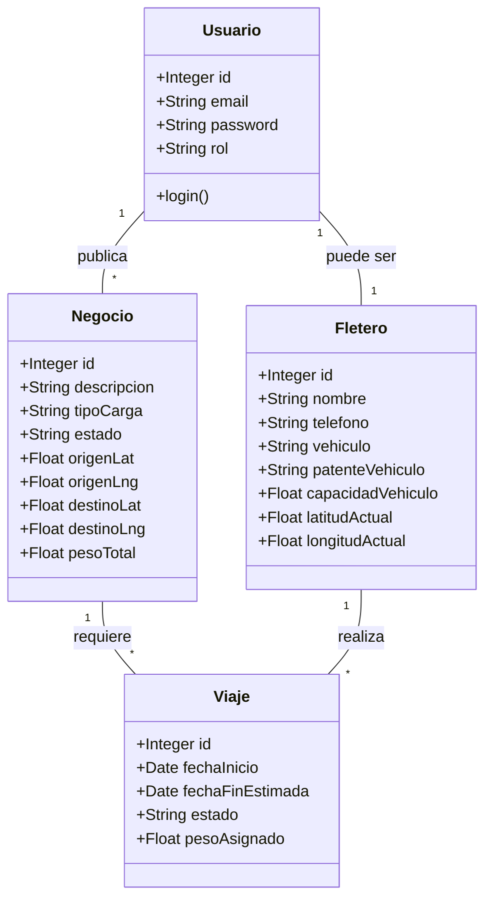

# Propuesta TP DSW

## Grupo

### Integrantes

- 43855 - [Gerster, Cristian](https://github.com/Gerster7)

### Repositorios

- [monorepo](https://github.com/Gerster7/rut.ar)
  _Nota_: si utiliza un monorepo indicar un solo link con fullstack app.

## Tema

### Descripción

_Plataforma web para la gestion y optimizacion de asignaciones logisticas que conecta Operadores Logisticos y Fleteros bajo la supervision de un Administrador. El objetivo central es reducir los kilometros recorridos vacios optimizando los viajes de retorno. El sistema asiste la toma de desiciones presentando sugerencias de matching basadas en proximidad geografica, historial de viajes y disponibilidad de fletero._

### Modelo

_Nota_: incluir un link con la imagen de un modelo, puede ser modelo de dominio, diagrama de clases, DER. Si lo prefieren pueden utilizar diagramas con [Mermaid](https://mermaid.js.org) en lugar de imágenes.

## Alcance Funcional

### Alcance Mínimo

_Nota_: el siguiente es un ejemplo para un grupo de 3 integrantes para un sistema de hotel. El

Regularidad:
|Req|Detalle|
|:-|:-|
|CRUD simple|1. CRUD Usuario 2. CRUD Fletero|
|CRUD dependiente|1. CRUD Negocio {depende de} CRUD Usuario  2. CRUD Viaje {depende de} CRUD Fletero y CRUD Negocio|
|Listado + detalle| 1. Listado de negocios filtrado por estado, muestra origen, destino y estado => detalle meuistra datos completos del Negocio y Fletero asignado  2. Listado de viajes del fletero filtrado por estado, meustra origen, destino y fecha estimada de fin => detalle muestra datos completos del Viaje y Negocio asociado|
|CUU/Epic|1. Buscar Fleteros disponibles para un negocio nuevo 2. Asignar un fletero a un negocio abierto|

Adicionales para Aprobación
|Req|Detalle|
|:-|:-|
|CRUD |1. CRUD Usuario 2. CRUD Fletero 3. CRUD Negocio 4. CRUD Viaje |
|CUU/Epic|1. Buscar Fleteros disponibles para un Negocio nuevo 2. Buscar un Negocio de retorno para un Viaje activo 3. Asignar un Fletero a un Negocio 4. Consultar Viajes asignados|

### Alcance Adicional Voluntario

_Nota_: El Alcance Adicional Voluntario es opcional, pero ayuda a que la funcionalidad del sistema esté completa y será considerado en la nota en función de su complejidad y esfuerzo.

| Req      | Detalle                                                                                                                                                                                                                                                      |
| :------- | :----------------------------------------------------------------------------------------------------------------------------------------------------------------------------------------------------------------------------------------------------------- |
| Listados | 1. Dashboard global de Administración con mapa unificado de todos los elementos activos filtrado por fecha, operador, fletero, estado o zona geografica                                                                                                      |
| CUU/Epic | 1. Monitoreo global de operaciones por el Administrador.                                                                                                                                                                                                     |
| Otros    | 1. Mapa interactivo con Leaflet y OpenStreetMap sincronizado con la grilla de resultados en las vistas de matching.   2. Scoring de candidatos calculado en backend mediante formula de Haversine e historial de viajes aplicando un sistema de puntajes. |

## Tecnologias a utilizar para el proyecto

### FrontEnd

| Tecnología / Librería          | Rol en el Proyecto                                                                                                                                 |
| ------------------------------ | -------------------------------------------------------------------------------------------------------------------------------------------------- |
| **Angular v21**                | Framework principal. Standalone components, inyección de dependencias, routing.                                                                    |
| **NgRx SignalStore**           | Gestión de estado global y local. Stores separados por feature (auth, negocios, viajes, mapa).                                                     |
| **Angular Router**             | Routing declarativo con guards de autenticación y de roles.                                                                                        |
| **Leaflet.js**                 | Mapa interactivo open-source. Renderizado de marcadores, clusters, polilíneas y popups. Tiles provistos por OpenStreetMap (gratuito, sin API key). |
| **Leaflet Routing Machine**    | Cálculo y visualización de rutas entre dos puntos usando OSRM (Open Source Routing Machine), sin costo.                                            |
| **Angular Material / PrimeNG** | Componentes UI (tablas, filtros, diálogos, formularios). A definir según preferencia de diseño.                                                    |
| **HttpClient + Interceptors**  | Comunicación HTTP con el backend. Interceptor de JWT para adjuntar el token automáticamente.                                                       |

### BackEnd

| Tecnología / Librería     | Rol en el Proyecto                                                                                                                                                                |
| ------------------------- | --------------------------------------------------------------------------------------------------------------------------------------------------------------------------------- |
| **Node.js (LTS)**         | Runtime de ejecución del servidor.                                                                                                                                                |
| **Express**               | Framework HTTP minimalista para definición de rutas, middlewares y controladores.                                                                                                 |
| **Sequelize ORM**         | Mapeo objeto-relacional sobre MySQL. Gestión de modelos, asociaciones, migraciones y seeders.                                                                                     |
| **JSON Web Tokens (JWT)** | Autenticación stateless. El servidor emite un token firmado al login; el cliente lo envía en cada request via header `Authorization: Bearer`.                                     |
| **bcrypt**                | Hash de contraseñas. Nunca se almacenan en texto plano.                                                                                                                           |
| **express-validator**     | Validación y sanitización de datos en los endpoints.                                                                                                                              |
| **dotenv**                | Gestión de variables de entorno (credenciales, secretos, configuración).                                                                                                          |
| **cors**                  | Control de acceso desde el dominio del frontend.                                                                                                                                  |
| **Pino + pino-http**      | Logger de alto rendimiento con salida JSON estructurada. Pino gestiona los logs de aplicación con niveles configurables; pino-http instrumenta automáticamente cada request HTTP. |
